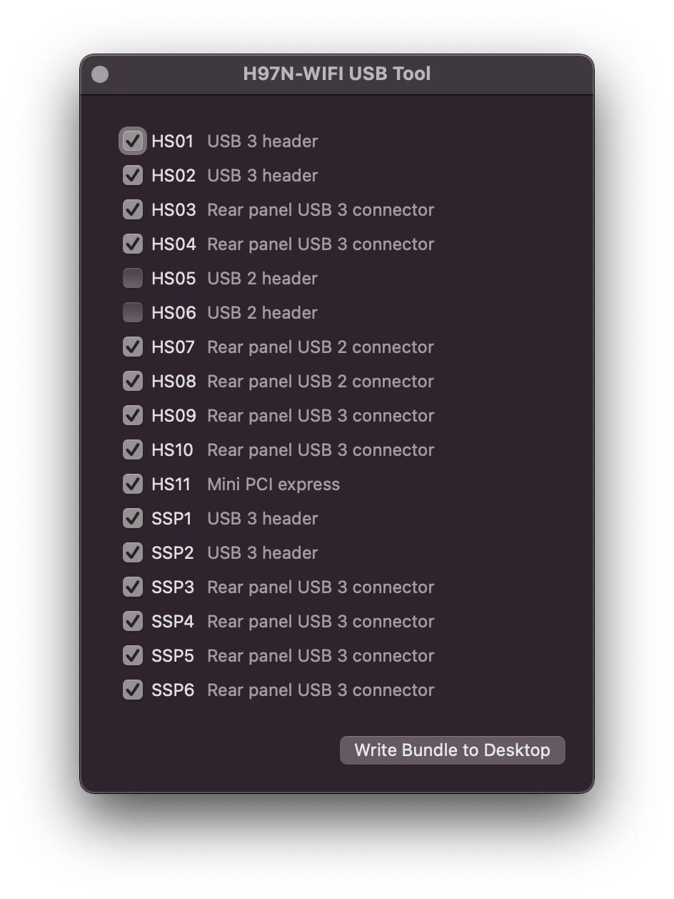

# usbtool.command



After completing the OpenCore `config.plist` according to [README.md](/README.md) and installing macOS, the following procedure will generate a valid `USBPorts.kext`

#### Run usbtool.command

- boot the H97N-WIFI system into macOS
- run `usbtool.command` located in the root directory of this repository
- keep within the 15 port limit by switching off at least 2 ports
- press the button to generate `USBPorts.kext` on the desktop

#### Install USBPorts.kext to the Bootloader Kexts Directory

- mount the EFI system partition
- replace `USBPorts.kext` in `/Volumes/EFI/EFI/OC/Kexts` with the version from the desktop

## Port Locations

<details><summary><strong>USB 2</strong></summary><br>

| Port | Location                   |
|:-----|:---------------------------|
| HS01 | USB 3 header               |
| HS02 | USB 3 header               |
| HS03 | Rear panel USB 3 connector |
| HS04 | Rear panel USB 3 connector |
| HS05 | USB 2 header               |
| HS06 | USB 2 header               |
| HS07 | Rear panel USB 2 connector |
| HS08 | Rear panel USB 2 connector |
| HS09 | Rear panel USB 3 connector |
| HS10 | Rear panel USB 3 connector |
| HS11 | Mini PCI express           |

<br></details>

<details><summary><strong>USB 3</strong></summary><br>

| Port | Location                   |
|:-----|:---------------------------|
| SSP1 | USB 3 header               |
| SSP2 | USB 3 header               |
| SSP3 | Rear panel USB 3 connector |
| SSP4 | Rear panel USB 3 connector |
| SSP5 | Rear panel USB 3 connector |
| SSP6 | Rear panel USB 3 connector |

<br></details>

<details><summary><strong>Rear Panel</strong></summary><br>

```text
 -------------------------------------------------------------------------
|  ------                                 __--__    __--__     ..     ..  |
| | HS07 |    .-.     .-.                | LAN2 |  | LAN1 |   (Or)   (LI) |
| |======|   (SMA)   (SMA)               | .... |  | .... |    ˜˜     ˜˜  |
| | HS08 |    ˜-˜     ˜-˜     ________    ======    ======     ..     ..  |
|  ------                     \=HDMI=/    ------    ------    (Bk)   (LO) |
|    --     ---------------     ˜˜˜˜     | SS04 |  | SS06 |    ˜˜     ˜˜  |
|  / PS \  | ######### ### |  ________   |======|  |======|  |˜˜˜˜|   ..  |
|  \ /2 /  | ######### ### |  \=HDMI=/   | SS03 |  | SS05 |  |TosL|  (Mi) |
|    --     \-------------/     ˜˜˜˜      ------    ------    ----    ˜˜  |
 -------------------------------------------------------------------------
 ```
Layout by [grumat](https://github.com/grumat)

</details>
